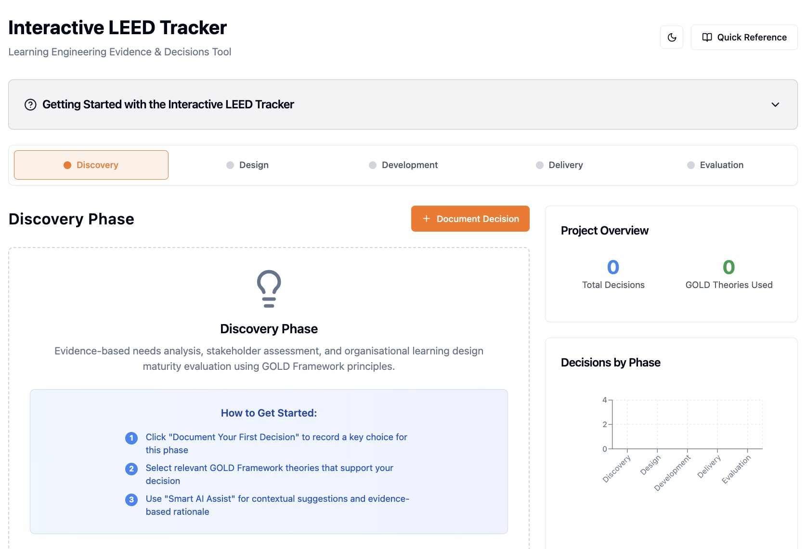

# Interactive LEED Tracker

Learning Engineering Evidence & Decisions Tool  
**Version: v1.0.0**

The **Interactive LEED Tracker** is a web application that helps learning-engineering teams document, visualise and share design decisions across the five product-development phases: **Discovery → Design → Development → Delivery → Evaluation**.



---

## Origins & Credits

This application is an open-source adaptation of the LEED Tracker concept originally created by **David Klaasen** and inspired by the [MIT Learning Engineering Evidence & Decision (LEED) Tracker](https://edtechbooks.org/jaid_13_2/why_did_we_do_that_a_systematic_approach_to_tracking_decisions_in_the_design_and_iteration_of_learning_experiences). Read David's article [Bridging Theory to Practice with AI](https://www.linkedin.com/pulse/bridging-theory-practice-ai-david-klaasen-wrnlf/?trackingId=5f%2BTB8GKTrK5yv8eIaxMXw%3D%3D) on LinkedIn for more details.

The codebase you are viewing is a community fork now actively **maintained by Simon Strehler**.

## ✨ Features

-   📚 **Phase navigator** – switch between the five LEED phases and view related decisions
-   📝 **Decision journal** – create, edit and delete rich decision entries with evidence, risks & success metrics
-   📊 **Dashboards & charts** – instant visual overview of progress and phase distribution
-   📤 **Export centre** – one-click export to CSV / PDF / DOCX for stakeholder reporting
-   🔐 **Authentication** – Supabase e-mail & social log-in
-   ☁️ **Cloud storage** – data persisted in Supabase Postgres
-   🎨 **Beautiful UI** – built with Tailwind CSS and shadcn/ui components

## 🛠 Tech Stack

| Layer                 | Technology                                                                                                   |
| --------------------- | ------------------------------------------------------------------------------------------------------------ |
| Front-end             | [Vite](https://vitejs.dev/) + [React](https://reactjs.org/) + [TypeScript](https://www.typescriptlang.org/)  |
| Styling               | [Tailwind CSS](https://tailwindcss.com/), [shadcn/ui](https://ui.shadcn.com/), [Lucide](https://lucide.dev/) |
| State / Data          | [TanStack React Query](https://tanstack.com/query)                                                           |
| Back-end-as-a-service | [Supabase](https://supabase.com/) (auth + database)                                                          |
| Tooling               | ESLint, Prettier, Husky, Vite preview                                                                        |

## 🚀 Getting Started

### Prerequisites

-   [Node.js](https://nodejs.org/) ≥ 20.x (use [nvm](https://github.com/nvm-sh/nvm) if you like)
-   A Supabase project (free tier is fine)

### 1. Clone & Install

```bash
git clone https://github.com/<your-org>/interactive-leed-tracker.git
cd interactive-leed-tracker
npm install # or pnpm / bun / yarn
```

### 2. Environment Variables

Create a `.env` file (or copy `.env.example`) in the project root and provide your Supabase credentials:

```ini
VITE_SUPABASE_URL="https://xyzcompany.supabase.co"
VITE_SUPABASE_ANON_KEY="public-anon-key"
```

> These are **publishable** keys – never commit your service-role / secret keys.

### 3. Run in Development

```bash
npm run dev
```

The app will be available at `http://localhost:5173` with hot-module-reload.

### 4. Database Migrations (optional)

SQL migrations live in `supabase/migrations`. If you created a fresh Supabase project you can apply them with the [Supabase CLI](https://supabase.com/docs/guides/cli):

```bash
supabase db push --local
```

---

## 📂 Project Structure

```
├── public/               # static assets (favicons, cover image …)
├── src/
│   ├── components/       # reusable UI + feature components
│   ├── hooks/            # custom React hooks
│   ├── integrations/     # Supabase client & generated types
│   ├── pages/            # route-level components (Auth, Index, 404)
│   ├── utils/            # helpers & utility functions
│   └── main.tsx         # Vite entry point
├── supabase/             # migrations & config.toml
├── tailwind.config.ts    # Tailwind design-system tokens
└── vite.config.ts        # Vite build / dev config
```

---

## 📜 Available Scripts

| Command           | Purpose                              |
| ----------------- | ------------------------------------ |
| `npm run dev`     | Launch development server with HMR   |
| `npm run build`   | Production build (output in `dist/`) |
| `npm run preview` | Preview the production build locally |
| `npm run lint`    | Run ESLint                           |

---

## ☁️ Deployment

The app is a static SPA – simply upload the `dist/` directory to any static host (Netlify, Vercel, Cloudflare Pages, GitHub Pages…). Ensure the following variables are set in the hosting dashboard:

-   `VITE_SUPABASE_URL`
-   `VITE_SUPABASE_ANON_KEY`

Netlify example:

```bash
npm run build
# then push to Git or drag-and-drop dist/ folder in Netlify UI
```

---

## 🤝 Contributing

1. Fork the repo
2. Create your branch: `git checkout -b feature/awesome`
3. Commit your changes: `git commit -m "feat: add awesome feature"`
4. Push the branch: `git push origin feature/awesome`
5. Open a Pull Request

---

## 📝 License

Distributed under the MIT License. See `LICENSE` for more information.
